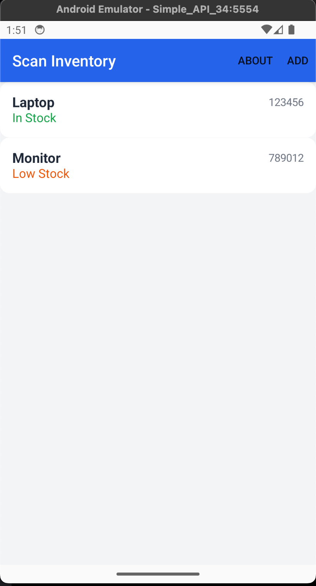
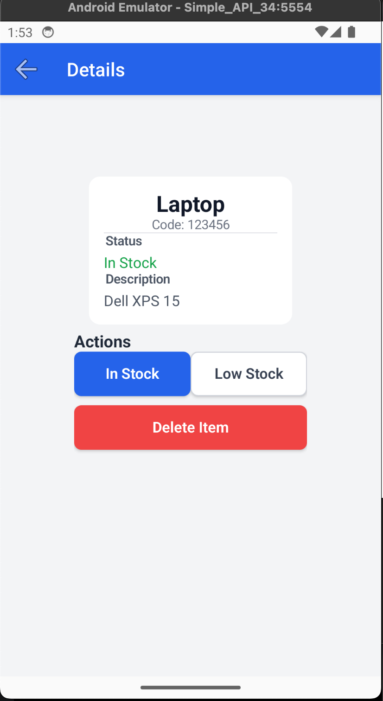
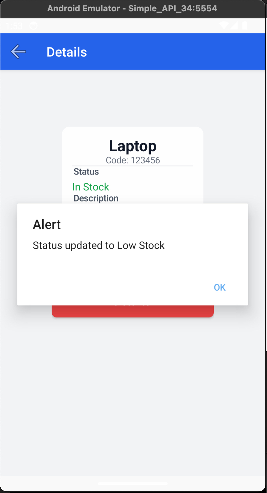
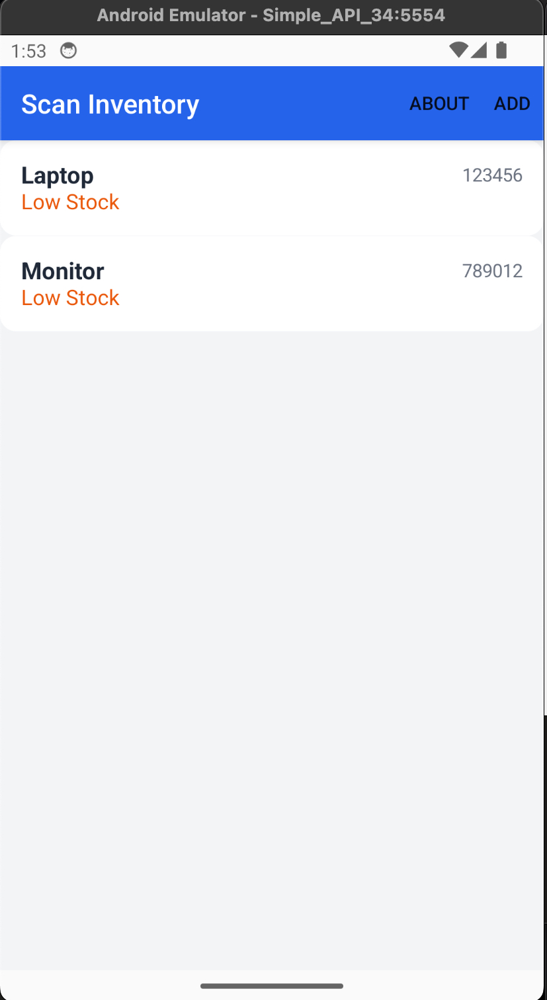
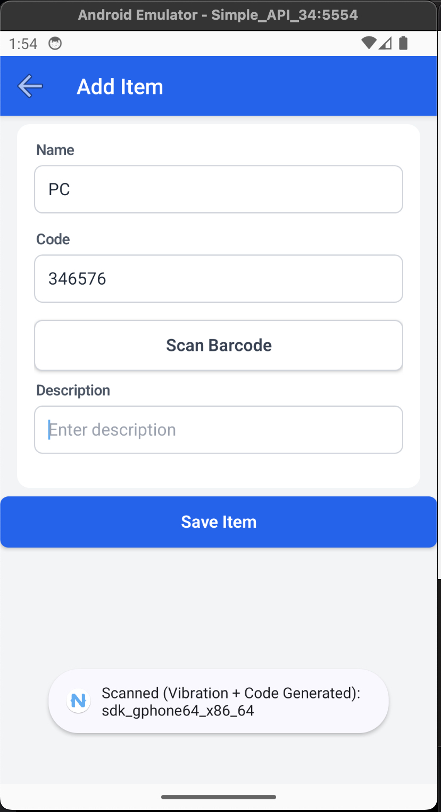
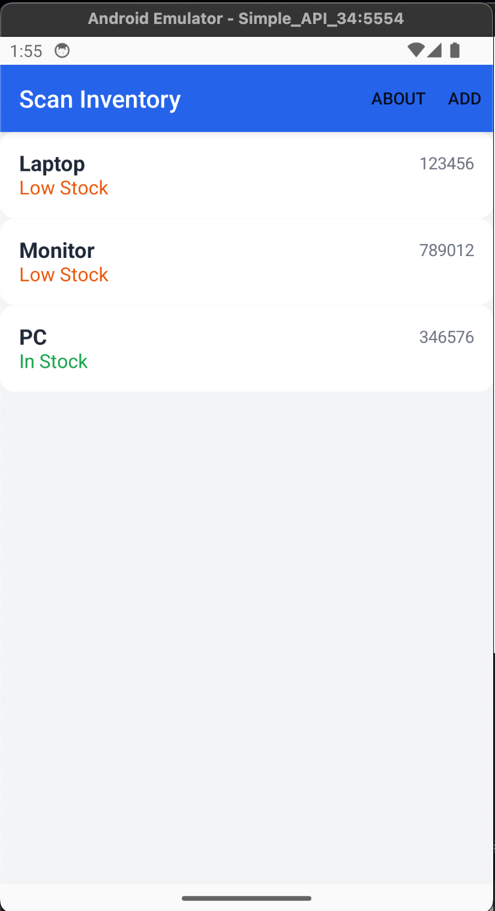
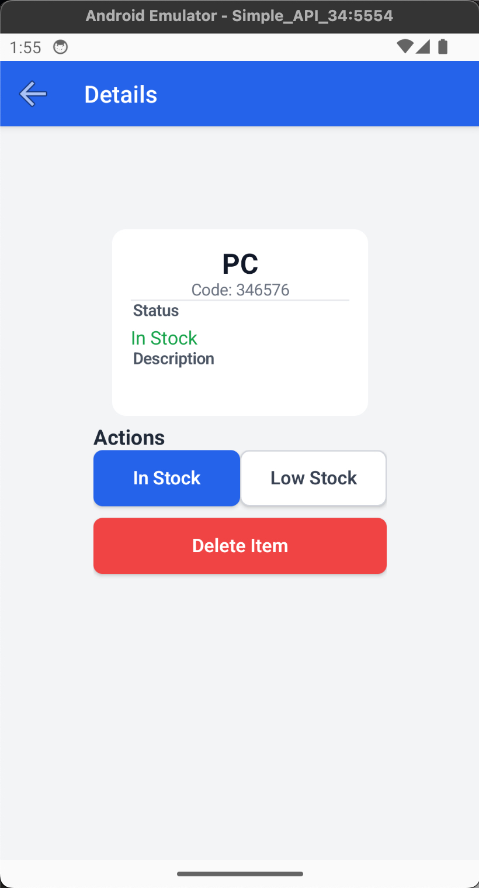
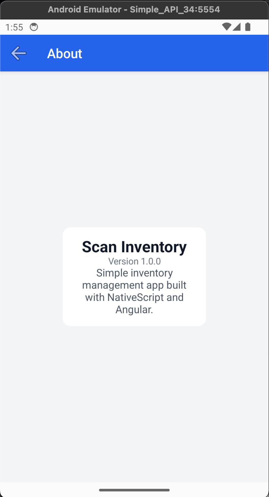

# NativeScript Inventory App

Projekt aplikacji mobilnej do zarządzania stanem magazynowym, zrealizowany w technologii **NativeScript + Angular**.

Aplikacja spełnia wszystkie wymagania funkcjonalne, w tym obsługę natywnych funkcji Androida oraz symulację komunikacji z API.

## Funkcjonalności i Widoki

Aplikacja składa się z 4 widoków, zapewniając pełną nawigację i obsługę procesów biznesowych:

1.  **Lista Produktów (Home):**
    - Wyświetla listę elementów z nazwą, unikalnym kodem oraz statusem.
    - Statusy są wizualnie rozróżnione kolorami (Zielony: In Stock, Pomarańczowy: Low Stock).
    - Pasek akcji umożliwia szybkie przejście do dodawania lub informacji o aplikacji.

2.  **Szczegóły Produktu (Detail):**
    - Pełny widok atrybutów: Nazwa, Kod, Opis, Status.
    - **Edycja:** Możliwość szybkiej zmiany statusu (In Stock / Low Stock).
    - **Usuwanie:** Możliwość trwałego usunięcia elementu z listy.

3.  **Dodawanie Produktu (Add):**
    - Formularz z walidacją (wymagane pola: Nazwa, Kod).
    - **Funkcja Natywna:** Przycisk "Scan Barcode" symuluje skaner, generując kod i uruchamiając wibracje telefonu.

4.  **O Aplikacji (About):**
    - Widok informacyjny z wersją aplikacji i opisem.

---

## Wykorzystane Funkcje Natywne

W aplikacji zaimplementowano bezpośredni dostęp do API systemu Android w widoku dodawania produktu (`InventoryAddComponent`).

**Wybrane funkcje:**

1.  **Wibracje (Haptic Feedback):**
    - **Uzasadnienie:** W warunkach magazynowych (hałas) potwierdzenie zeskanowania kodu wibracją jest kluczowe dla UX pracownika.
    - **Implementacja:** Użycie `android.os.Vibrator` poprzez kontekst aplikacji.
2.  **Natywne Powiadomienia (Toast):**
    - **Uzasadnienie:** Standardowy dla Androida sposób informowania o sukcesie operacji bez przerywania pracy użytkownika.
    - **Implementacja:** Użycie `android.widget.Toast`.
3.  **Informacje o Urządzeniu:**
    - Pobieranie modelu urządzenia (`Device.model`) do logów lub potwierdzeń.

---

## API i Architektura

Aplikacja realizuje wzorzec architektury opartej na serwisach (`InventoryService`).

- **Symulacja API:** Ze względu na brak zewnętrznego backendu, serwis symuluje opóźnienia sieciowe (`delay`) i zwraca obiekty `Observable` (RxJS).
- **Asynchroniczność:** Wszystkie operacje (Pobierz, Dodaj, Edytuj, Usuń) są asynchroniczne, co przygotowuje aplikację do łatwego podpięcia `HttpClient` w przyszłości.
- **Walidacja:** Formularze posiadają zabezpieczenia przed wysłaniem pustych danych.

---

## Technologie

- **Framework:** NativeScript 8+ z Angular 18+ (Standalone Components)
- **Styling:** Tailwind CSS (responsywny design)
- **Język:** TypeScript

## Uruchomienie

Aby uruchomić projekt lokalnie na emulatorze Androida:

```bash
npm install
ns run android
```

## Zrzuty Ekranu

|       Lista Produktów       |       Szczegóły Produktu        |
| :-------------------------: | :-----------------------------: |
|  |  |
|      **Ekran główny**       |      **Widok szczegółów**       |

|       Zmiana Statusu        |           Aktualizacja Listy           |
| :-------------------------: | :------------------------------------: |
|  |  |
|  **Potwierdzenie zmiany**   |         **Odświeżony status**          |

|       Dodawanie Produktu        |         Funkcja Natywna          |
| :-----------------------------: | :------------------------------: |
|  |  |
|          **Formularz**          |     **Toast po skanowaniu**      |

|              Nowy Element              |         O Aplikacji         |
| :------------------------------------: | :-------------------------: |
|  |  |
|           **Produkt dodany**           |   **Informacje o wersji**   |
